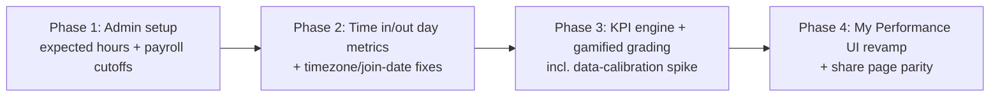

# Member Performance KPI — Phased Revamp

> **Status:** Implemented in the working tree; correctness and activity-evidence follow-up completed. Signed-in acceptance QA pending.

## Status

- [x] Phase 1 spec reviewed (expected-hours + payroll-cutoff admin settings) — refined 2026-09-08: span-based day length (D1), timezone-bucketing confirmed (D2), schema-`.refine()` fix added.
- [x] Phase 1 database migration generated (`expectedDailyHours`, `payrollCutoffDays` on `workspaces`) — `drizzle/0023_cold_typhoid_mary.sql`, additive ADD COLUMN only, applied and verified.
- [x] Phase 1 backend implemented (schema validation, workspace-settings update, state exposure, payroll-period helper + tests). Note: the settings schema had a second live copy in `tracker.ts`; both were consolidated into `shared/schemas.ts`.
- [x] Phase 1 frontend implemented (settings tab + panel + `TrackingExpectationsPanel.test.tsx`).
- [x] Phase 1 validated: `pnpm typecheck`, `pnpm lint`, `pnpm test` (332 tests / 69 files), `pnpm build`, and a dev-server boot smoke test (routes respond, auth gating intact). In-app admin QA (§10 steps 1–6) still needs a signed-in admin session.
- [x] Phase 2/3/4 spun out as their own PLAN.md files before implementation begins — implemented 2026-09-08, see `phase-2/`, `phase-3/` (calibration data included), `phase-4/`.

## Current implementation audit — 2026-09-08

User confirmed: **time-tracking grades only for now**. Task descriptions provide evidence; task completion, deadlines, and quality do not affect grades.

Phases 1–4 are present in source: workspace expectations and payroll settings, timezone-based daily aggregation, composite KPI calculation, monthly history, payroll-period score, and private/public summary UI. Earlier migration application and calibration figures above are historical implementation notes, not independently re-run in this audit. No deployment was performed.

### Follow-up implemented

- Approved manual-time scoring: manual hours earn 50% credit across components; actual time stays unchanged. Details and historical-data limitations are in `phase-3/PLAN.md`. Entry source is now visible, and future timestamp edits are classified as manual.

- Fixed private year/public month queries to use workspace-local boundaries, including the first local hours of a month before UTC rolls over. Excluded future starts and future completion timestamps.
- Made private period filters use the payload's workspace-local last date.
- Fixed current streak calculation: only an explicitly open day may be skipped; a missed closed final weekday breaks the streak.
- Added a private **Daily work record** for the last 30 days: first time in, last time out, day span, tracked time, and expandable entry descriptions/project/timestamps. Descriptions are not added to public share responses.
- Reused the existing member-scoped query; no extra database round trips. Activity entries are grouped once for rendering and only the latest 30 days of descriptions are sent to the client.

### Remaining policy limits

- Overnight entries remain assigned to their start day, matching existing timesheets. This is explicitly described in the daily record; calendar-day splitting would require a coordinated timesheet/KPI policy change.
- Running timers are excluded until stopped. Today's score is provisional and includes today's expected workday.
- Weekdays are Monday–Friday, without holidays, leave, or per-member schedules.
- Historical scores are recalculated using current workspace expectations; there are no versioned grading policies or frozen historical grades.
- The 12-hour span cap and one-hour break allowance need policy review before using expectations above 11 hours/day (the settings currently permit up to 24).
- Project chart totals still cover the loaded year while the activity trend has a selectable period; aligning those filters is a separate remaining UI improvement.

### Validation results — 2026-09-08

- `pnpm typecheck`, `pnpm lint`, and `pnpm build` passed.
- `pnpm test`: 356 tests passed across 72 files. Vitest reported a shutdown timeout after successful completion; the command exited 0.
- React Doctor stayed at 77/100 with the same 14 pre-existing findings after the follow-up.
- Isolated browser fixture checked at 1280px and 390px: entry expansion works, workspace-local timestamps render correctly, and the table scrolls within its container without page overflow. This is component visual QA, not signed-in end-to-end validation.
- The live private route returned its expected unauthenticated redirect. Build warnings include the existing `catalogs-route.ts` route-file warning and missing Sentry release token.

### Acceptance checks

Automated coverage includes timezone query boundaries, closed-day streaks, local clock display, task-entry evidence, and weekend/empty-day labels. Signed-in QA at `http://localhost:3000/app/my-performance` remains required:

1. Complete two entries separated by a break. Confirm the daily record shows first start/last end, span includes the break, and tracked time matches the entries.
2. Expand the day and verify descriptions, project names, and individual timestamps. Check narrow mobile layout and keyboard expansion.
3. Compare early-morning activity on the first local day of a month between private and public summaries.
4. Check a closed month ending on a missed weekday: current streak must be zero. An unfinished current day may preserve the preceding streak.
5. Change expectations in workspace settings and confirm the KPI updates; task descriptions must have no scoring effect.

## 1. Goal

Replace the current My Performance grading (which scores almost everyone an A because it only measures "did you log ≥ 1 second on ≥ 90% of weekdays") with a **meaningful, gamified KPI** that:

1. Lets an **admin define how many hours members are expected to work per day** (same expectation for everyone).
2. Lets an admin define the company's **payroll cutoff days** so KPI periods can later align to real pay periods (e.g. "10th & 20th", "15th & month-end").
3. Rewards the **length of the working day, measured as a span — first activity of the day (time in) through last activity of the day (time out)** — rather than summed tracked hours, so members who work 9–10-hour days are scored differently from members who work 7–8, including recognition for early starts / late finishes. Rationale (D1): members commonly clock in early, stop their timers mid-day, then work again later and clock out; summed tracked seconds hide those long days, the first-to-last-activity span captures them.
4. Raises the bar so A is earned, while keeping the fun A–F + badge language.

This document specifies **Phase 1: Setup** in full (admin-configurable expectations + payroll cutoffs). Phases 2–4 (time-in/time-out metrics, the KPI engine, and the UI revamp) are outlined in §11 with their own plan files to be written before implementation.

## 2. Context Summary

**What exists today:**

- The page `/app/my-performance` (`src/routes/app/my-performance.tsx`) renders `PerformancePage` (`src/components/time-tracker/performance/PerformancePage.tsx`) from `getMyPerformance()` (`src/lib/server/tracker/performance.server.ts`).
- The current grade lives in two functions only:
  - `buildMonthSummary()` (lines ~101–130) → `activePercent = round(activeDays / workingDays × 100)`, where a day is "active" when a completed entry has `> 0` seconds on a weekday.
  - `computeGrade()` (lines ~78–87) → A ≥ 90 / B ≥ 75 / C ≥ 60 / D ≥ 40 / F otherwise (badges Platinum/Gold/Silver/Bronze/Starter).
- Why everyone scores A: the metric is **binary per day** (any second counts) and **saturates**; volume of hours is never measured. `docs/analytics-enhancement-plan.md` already flags the adjacent gaps: attendance-style reporting ("❌ (rollup already stores first/last entry per day)") and utilization/adherence ("⚠️ single utilization % on dept dashboard").
- **Time in / time out already exists as data:**
  - `analytics_daily_member_metrics` (`src/db/schema.ts` ~L1115) stores `firstEntryAt` / `lastEntryAt` per member/day, plus `entryCount`, `totalSeconds`, `billableSeconds`, `departmentId`. It is maintained synchronously by `src/lib/server/tracker/analytics-rollups.server.ts` (`recomputeAnalyticsDailyMemberMetric`) via `pendingAnalyticsRollups`.
  - The Timesheet weekly view already computes per-day `timeIn` / `timeOut` from entries with workspace-timezone day bucketing: `TimesheetDayCell` and `aggregateTimesheetEntries()` in `src/lib/time-tracker/timesheet.ts`, consumed by `src/lib/server/tracker/timesheet.server.ts`.
  - Both sources already expose everything needed for a **span-based day length** (`firstEntryAt → lastEntryAt`) — which is what the KPI scores on (D1).
- **Admin settings infrastructure:**
  - Route `/app/workspace/settings` (`src/routes/app/workspace/settings.tsx`) gates on `workspace.settings.view` and loads `getWorkspaceSettingsStateFn()`.
  - `SettingsScreen` (`src/components/time-tracker/screens/SettingsScreen/SettingsScreen.tsx`) renders tabs defined in `SettingsTabList.tsx` (`'general' | 'location' | 'integrations' | 'developer'`; `manageOnly` flag hides tabs without `workspace.settings.manage`).
  - Workspace values are updated by `updateWorkspaceSettings()` in `src/lib/server/tracker/workspace-settings.server.ts` (audit-logged `WORKSPACE_UPDATE`; Drizzle omits `undefined` keys) via `updateWorkspaceSettingsFn` (`src/lib/server/tracker.ts`), validated by `updateWorkspaceSettingsSchema` in `src/lib/server/tracker/shared/schemas.ts`. ⚠️ That schema ends with a `.refine()` requiring `name` or `timezone` to be present — it **must** be extended alongside any new fields, or a save containing only the new fields is rejected (see §7).
  - The workspace object exposed to the client is `Workspace` in `src/lib/time-tracker/types.ts` (name, timezone, billing, location flag…), hydrated in `getTrackerStateLite()` (`src/lib/server/tracker/state-lite.server.ts`).
- `workspaces.timezone` exists (default `Asia/Manila`) — day/week/month math for payroll periods should use it, matching the pattern in `src/lib/server/tracker/shared/dates.ts` (`formatDateInTimeZone`, `getWorkspaceDateRange`).

**Assumptions (defaults chosen because stakeholder input is pending — see §13):**

| #   | Assumption                                                                                                                              | Default chosen in this plan                                                               |
| --- | --------------------------------------------------------------------------------------------------------------------------------------- | ----------------------------------------------------------------------------------------- |
| A1  | Expected hours are identical for every member (user: "expectations are the same")                                                       | Workspace-level setting, default **8.0 h/day**                                            |
| A2  | "15–30" payroll cutoffs mean periods closing on the 15th and at month-end                                                               | Stored as `payrollCutoffDays = [15]`; the end of the month always closes the final period |
| A3  | "10 and 20" cutoffs mean periods closing on the 10th, 20th, and at month-end                                                            | Stored as `payrollCutoffDays = [10, 20]`                                                  |
| A4  | A "work day" is a calendar day in the **workspace timezone**, Mon–Fri                                                                   | Used by Phase 2+ helpers; Phase 1 only stores config                                      |
| A5  | Phase 1 changes nothing about current grades (no behavior change for members)                                                           | New settings are displayed and validated only                                             |
| A6  | The daily span cap / anti-gaming guardrails (span cap ~12 h/day + minimum fill ratio) are Phase 3 scoring constants, not Phase 1 config | Not stored in Phase 1                                                                     |

**Decisions (stakeholder review, 2026-09-08):**

- **D1 — Day length is a span, not a sum.** The KPI's day-length signal is `firstEntryAt → lastEntryAt` in the workspace timezone. Reason: members clock in early, stop their timers mid-day (breaks, errands), then work again later — summed tracked seconds understate those long days. Tracked seconds (`totalSeconds`) remain a secondary signal and power the anti-gaming `fillRatio = trackedSeconds ÷ daySpanSeconds` (a near-zero fill = "clocked in, idle, clocked out").
- **D2 — Timezone-correct day bucketing is confirmed in scope (Phase 2).** It stays out of Phase 1 because changing bucketing changes member-facing numbers and would break Phase 1's "grades byte-for-byte identical" guarantee.
- **D3 — The span-vs-tracked-hours ambiguity is resolved by D1** for the Depth component. The Phase 3 calibration spike still decides the exact span→credit curve (e.g. whether full credit means span = `expectedDailyHours`, or expected + a fixed break allowance such as 8 h + 1 h lunch = 9 h span).

## 3. Scope

**Phase 1 (this document):**

- Add two workspace-level configuration fields: `expectedDailyHours` (number, default 8.0) and `payrollCutoffDays` (ordered day-of-month array, default `[15]`).
- Extend `updateWorkspaceSettingsSchema` + `updateWorkspaceSettings()` to accept and audit-log the new fields.
- Expose the fields through `TrackerState.workspace` / `Workspace` type.
- Add a pure, unit-tested payroll-period helper module (`derive periods from cutoff days + month in workspace timezone`).
- Add a manage-only Workspace Settings tab **"Working hours & payroll"** with a panel to edit both fields, with live payroll-period preview and save/validation UX following `WorkspaceInfoPanel` patterns.
- Update the settings tab grid so a 5th tab lays out correctly.
- Run the Drizzle migration and backfill defaults for existing workspaces.

**Phase 2 (outline only — own PLAN.md later):**
Time-in/time-out day metrics: derive day span (`firstEntryAt → lastEntryAt`, per D1) per member/day from the analytics rollup (preferred — already maintained synchronously) or timesheet aggregation, with timezone-correct bucketing landed first; surface "active span", early-start / late-finish vs. expected hours, and `fillRatio` as a secondary signal; fix UTC bucketing in performance rollups; prorate against member join date; grade only closed months.

**Phase 3 (outline only — own PLAN.md later):**
KPI engine: composite score (`Depth ≈ hours vs expected` / `Consistency` / `Timeliness`), new grade thresholds that spread members, gamification (component bars, streaks, pace meter), payroll-period-aligned KPI periods. Calibrate against real data via a read-only spike before shipping thresholds.

**Phase 4 (outline only — own PLAN.md later):**
UI revamp of My Performance + public share page parity + optional team/leaderboard visibility.

## 4. Out of Scope

- **No grading/score changes in Phase 1.** Members' grades must be byte-for-byte identical **through Phase 1**. Phase 2's correctness fixes (timezone bucketing, partial-month handling) are allowed to shift grades slightly — that is intended, and should be called out when Phase 2 ships.
- No per-member or per-department overrides of expected hours (future phase, revisit after A1).
- No actual payroll, payslip, or export functionality; cutoffs are stored so _metric periods_ can align to them later.
- No new clock-in/clock-out _feature_ (a dedicated punch system). Time in/out is derived from existing completed `time_entries` (see §2).
- No holidays/PTO/leave calendars.
- No changes to `time_entries`, `analyticsDailyMemberMetrics`, or timesheet queries in Phase 1.
- No email notifications, no leaderboards, no permission-role changes.

## 5. Affected Files and Folders

```
plans/performance-kpi-revamp/
└── PLAN.md                                    (NEW) this plan

src/db/
├── schema.ts                                  (MODIFY) add workspaces.expectedDailyHours + payrollCutoffDays

drizzle/                                       (MODIFY) generated migration snapshot (via pnpm db:generate)

src/lib/time-tracker/
├── types.ts                                   (MODIFY) Workspace: add expectedDailyHours, payrollCutoffDays
└── payroll-periods.ts                         (NEW) pure helper: derive payroll periods from cutoff days
└── payroll-periods.test.ts                    (NEW) vitest coverage, co-located with payroll-periods.ts

src/lib/server/tracker/
├── state-lite.server.ts                       (MODIFY) include new workspace fields in TrackerState
├── workspace-settings.server.ts               (MODIFY) updateWorkspaceSettings(): set + audit new fields
└── shared/schemas.ts                          (MODIFY) updateWorkspaceSettingsSchema: optional expectedDailyHours, payrollCutoffDays

src/components/time-tracker/screens/SettingsScreen/
├── SettingsTabList.tsx                        (MODIFY) add 'expectations' tab (label, icon, manageOnly), dynamic grid-cols
├── SettingsTabList.test.tsx                   (MODIFY) assert new tab + normalization
├── SettingsScreen.tsx                         (MODIFY) render expectations tabpanel
└── TrackingExpectationsPanel.tsx              (NEW) admin form: expected hours + payroll cutoffs + period preview
```

Later phases add files under `src/lib/server/tracker/performance*.server.ts`, `src/components/time-tracker/performance/*`, and `src/routes/app/my-performance.tsx` — tracked in their own plan documents.

## 6. Database Design

Add two columns to `workspaces` (`src/db/schema.ts`, after `locationTrackingEnabled`, ~L260):

```ts
expectedDailyHours: numeric('expected_daily_hours', {
  precision: 4,
  scale: 2,
})
  .notNull()
  .default('8.00'),
payrollCutoffDays: jsonb('payroll_cutoff_days')
  .$type<number[]>()
  .notNull()
  .default([15]),
```

Semantics:

- `expectedDailyHours` — how many hours a member is expected to track on a working day. Validated client- and server-side to be a number in `[1, 24]` with `0.5` granularity.
- `payrollCutoffDays` — ordered, unique integers `1–28`. A payroll period runs from the day after the previous cutoff through the next cutoff; the **end of the month always closes the final period** of that month.
  - `[15]` → periods close on the 15th and at month-end (i.e. "15 / 30–31").
  - `[10, 20]` → periods close on the 10th, the 20th, and at month-end.
- Both columns are workspace-global for now (A1, A2/A3).

No seed data needed; existing rows get the column defaults via migration `default(...)` values (backfilled by Drizzle's migration on add-column-with-default).

## 7. Backend Implementation

**`shared/schemas.ts`** — extend `updateWorkspaceSettingsSchema` with optional keys:

```ts
expectedDailyHours: z.number().min(1).max(24).multipleOf(0.5).optional(),
payrollCutoffDays: z
  .array(z.number().int().min(1).max(28))
  .min(1)
  .max(6)
  .refine((days) => days.every((d, i) => i === 0 || d > days[i - 1]), {
    message: 'Cutoff days must be unique and in ascending order.',
  })
  .optional(),
```

⚠️ **Also extend the trailing schema `.refine()`**: it currently rejects any payload without `name`/`timezone` (`'At least one setting is required.'`), which would fail _every_ save from the new panel (its payload contains only the new fields). The predicate must accept any of the four keys:

```ts
.refine(
  (data) =>
    data.name !== undefined ||
    data.timezone !== undefined ||
    data.expectedDailyHours !== undefined ||
    data.payrollCutoffDays !== undefined,
  { message: 'At least one setting is required.' },
)
```

**`workspace-settings.server.ts`** — in `updateWorkspaceSettings()`, extend the Drizzle `.set()` and the audit-log `details` array with the two new fields (following the existing "Drizzle omits `undefined` keys" pattern). Permission unchanged: `workspace.settings.manage`.

**`state-lite.server.ts`** — include `expectedDailyHours: Number(access.workspace.expectedDailyHours)` and `payrollCutoffDays: access.workspace.payrollCutoffDays` in the `workspace` object returned by `getTrackerStateLite()`.

**`types.ts`** — extend the `Workspace` type with `expectedDailyHours: number` and `payrollCutoffDays: number[]` so `TrackerState` carries them to `SettingsScreen`.

**`payroll-periods.ts` (NEW, pure)** — mirror the conventions of `src/lib/time-tracker/timesheet.ts`:

```ts
export function buildPayrollPeriods(
  cutoffDays: number[],
  monthKey: string, // 'YYYY-MM' in workspace timezone
  timezone: string,
): { label: string; startDate: string; endDate: string }[]
```

Returns every period fully contained in the month (open/closed periods flagged by a `closed: boolean` for the current month when `endDate > today`). Used in Phase 1 by the settings panel preview and reused in Phase 3 for period-aligned KPIs.

**Server fn** — no new server fn required; `updateWorkspaceSettingsFn` already exists in `src/lib/server/tracker.ts` and passes through `updateWorkspaceSettingsSchema`.

## 8. Frontend Implementation

**Settings tabs** (`SettingsTabList.tsx`):

- Extend the `SettingsTab` union: `'general' | 'location' | 'integrations' | 'expectations' | 'developer'`.
- Add a tab entry `{ id: 'expectations', label: 'Working hours & payroll', description: 'Tracking expectations and pay periods', icon: Target (or Timer), manageOnly: true }`.
- Fix the grid: replace `visibleTabs.length === 4 ? 'sm:grid-cols-4' : 'sm:grid-cols-3'` with a dynamic class (`sm:grid-cols-5` when 5 tabs, or `sm:grid-cols-[repeat(auto-fit,minmax(0,1fr))]`), keeping `overflow-x-auto` for mobile.
- Update `normalizeSettingsTab()` automatically (it derives from `settingsTabs`).
- Members **without** `workspace.settings.manage` do not see the tab (same as Developer).

**`TrackingExpectationsPanel.tsx` (NEW)** — manage-only form on the expectations tab:

- **Expected hours per day**: numeric input + −/+ steppers, step `0.5`, min `1`, max `24`, quick-preset buttons (e.g. 7 / 8 / 9). Shows helper copy: "Used for consistency and KPI grading. Same for all members."
- **Payroll cutoff days**: chips for preset schedules (`15th & month-end` → `[15]`, `10th & 20th & month-end` → `[10, 20]`, Custom) plus a chip row for days 1–28 toggle. Validation hint mirrors the zod rules.
- **Period preview**: renders the next two derived payroll periods for the _current workspace month_ using `buildPayrollPeriods()` + workspace timezone, so the admin sees exactly what the config means.
- **Save**: `updateWorkspaceSettingsFn({ data: { expectedDailyHours, payrollCutoffDays } })` → `router.invalidate()` → success `gooeyToast`, with inline error state on invalid input (mirrors `WorkspaceInfoPanel`).
- Loading/disabled state while saving; values initialized from `state.workspace`.

**State plumbing** — the settings route already passes `state` (TrackerState) into `SettingsScreen`, so only the new tab + panel need wiring; no route-loader changes.

## 9. Access Control

| Capability                                | Permission key                  | Owner / Admin w/ settings.manage | Members without settings.manage                   |
| ----------------------------------------- | ------------------------------- | -------------------------------- | ------------------------------------------------- |
| View `/app/workspace/settings`            | `workspace.settings.view`       | ✅                               | ✅                                                |
| See "Working hours & payroll" tab + panel | `workspace.settings.manage`     | ✅                               | ❌ (tab hidden, `manageOnly`)                     |
| Edit expected hours / payroll cutoffs     | `workspace.settings.manage`     | ✅                               | ❌                                                |
| Read new fields in tracker state          | `workspace.settings.view` scope | ✅ (via state)                   | ✅ (fields harmless; values are workspace-global) |
| View `/app/my-performance`                | any member (unchanged)          | ✅                               | ✅                                                |

No changes to role definitions or permission overrides; enforcement is purely `assertPermission(access, 'workspace.settings.manage')` inside `updateWorkspaceSettings()` + the `manageOnly` tab flag.

## 10. Validation

Commands:

- `pnpm typecheck`
- `pnpm lint`
- `pnpm test` (runs vitest; ensure new `payroll-periods.test.ts` and updated `SettingsTabList.test.tsx` pass)
- Migration: `pnpm db:generate` then `pnpm db:migrate` (or `pnpm db:push` in dev) — verify the generated SQL adds both columns with defaults.

Manual QA smoke test:

1. As an admin with settings manage → open `/app/workspace/settings?tab=expectations`; confirm tab shows and layout is correct on desktop and mobile widths.
2. Set expected hours to 9.0 and cutoffs to `[10, 20]` → Save → toast; reload page → values persisted; period preview shows three periods (1–10, 11–20, 21–EOM). This save payload intentionally omits `name`/`timezone`, so it also exercises the schema `.refine()` extension from §7.
3. Attempt invalid values (0, 24.5, cutoffs `[20, 10]`) → inline validation errors, nothing saved.
4. As a member without `workspace.settings.manage` → the expectations tab is not visible.
5. `/app/my-performance` renders identically to before (grades untouched in Phase 1).
6. `logs`/audit trail records a `WORKSPACE_UPDATE` with the changed fields (if using the audit panel).
7. `pnpm lint` passes with no warnings; no changes to unrelated components.

## 11. Sequencing



- **Phase 1 (specified above)** — independently shippable; members see no behavior change. Checkboxes in the Status section track it.
- **Phase 2 — Time in / time out & day metrics.** Order matters inside the phase: (1) switch performance day math from UTC to workspace-timezone bucketing **first** (reuse the `dateKeyInTimeZone` pattern from `src/lib/time-tracker/timesheet.ts`) so every later metric sits on correct days; (2) adopt `firstEntryAt`/`lastEntryAt` from the analytics rollup (preferred — maintained synchronously) or `aggregateTimesheetEntries` (timesheet) as the source of per-day metrics; (3) define `daySpanSeconds = lastEntryAt − firstEntryAt` as the **primary** day-length metric (D1), retaining `totalSeconds` alongside it plus `fillRatio = totalSeconds ÷ daySpanSeconds` as the anti-gaming signal (near-zero fill = clocked in, idle, clocked out); (4) derive early-start / late-finish signals from `firstEntryAt`/`lastEntryAt`. Structural fixes: no letter-grade on partial months (show pace instead — today the current month is letter-graded against only elapsed weekdays, so a member can hold an A on day 3), prorate months by member join date, working-day calendar in workspace timezone. Includes a backfill/consistency check between rollup and raw entries. → new PLAN.md.
- **Phase 3 — KPI engine.** Composite score, e.g. `Depth (day span vs expected, capped) × ~60% + Consistency × ~25% + Timeliness (same-day logging) × ~15%`. Depth is measured on `daySpanSeconds` per D1 — the calibration spike decides the span→credit curve (full credit at span = `expectedDailyHours`, or expected + a break allowance, e.g. 8 h + 1 h lunch = 9 h; see D3). Re-tuned A–F thresholds (A ≈ ≥85, not ≥90 on a saturating metric); gamification (component bars, streaks, long-day counts, "points to next grade" by weakest component, month pace meter); KPI computed per payroll period (from `payrollCutoffDays`) and per calendar month. Caps/guardrails so extreme spans cannot be gamed: per-day span cap (~12 h) **and** a minimum `fillRatio` below which a span earns reduced or no Depth credit. **Run a read-only distribution spike on real data first to calibrate thresholds, the span→credit curve, and the fill-ratio floor.** → new PLAN.md.
- **Phase 4 — UI revamp.** Rebuild the My Performance page around the new KPI: sub-score breakdowns, streaks/pace, day span and tracked hours shown side-by-side (so span-based scoring is transparent rather than mysterious), updated copy (move away from pure "consistency" language); keep the public share page consistent; optional leaderboard/rank vs workspace median behind an admin toggle. → new PLAN.md.

## 12. Risks & Considerations

| Risk                                                                                            | Mitigation                                                                                                                                                                                                                                                                        |
| ----------------------------------------------------------------------------------------------- | --------------------------------------------------------------------------------------------------------------------------------------------------------------------------------------------------------------------------------------------------------------------------------- |
| Rewarding long spans encourages overwork, padded presence, or "clock in and idle all day"       | Phase 3 caps counted span/day (~12 h) and applies a minimum `fillRatio` (`trackedSeconds ÷ daySpanSeconds`) so idle-heavy spans earn reduced Depth credit; timeliness weight (same-day logging) exposes backfill padding; copy keeps "not a productivity judgment" framing honest |
| Span includes breaks/idle by design (D1) — a 10 h span may hold only 8 h tracked                | Intended: span measures presence/availability, tracked seconds measure work. Phase 4 shows both side-by-side so the distinction is visible, not hidden; calibration spike (D3) sets how much break allowance full credit grants                                                   |
| UTC vs workspace-timezone day bucketing corrupts day/period math (esp. `Asia/Manila` workspace) | All new period/day helpers take `workspace.timezone`; Phase 2 switches performance math off UTC; reuse `shared/dates.ts` helpers                                                                                                                                                  |
| Payroll cutoff semantics misunderstood (A2/A3)                                                  | Live period preview in the settings UI + explicit open questions; defaults only `[15]`                                                                                                                                                                                            |
| Config drift / silent surprises for existing members                                            | New columns get safe defaults (8.0, `[15]`); Phase 1 never changes grades; admin-only editing; audit-logged                                                                                                                                                                       |
| 5th settings tab breaks the existing tab grid                                                   | Replace hard-coded `grid-cols-3/4` with dynamic layout; verify at `sm` breakpoint (QA step 1)                                                                                                                                                                                     |
| `jsonb` array validation mismatch between UI and DB                                             | Single source of truth: `updateWorkspaceSettingsSchema` refine; UI mirrors rules; unit tests on schema                                                                                                                                                                            |
| Phase 3 thresholds tuned wrong (still no spread, or too harsh)                                  | Mandatory calibration spike on real distribution before shipping; weights/thresholds kept as constants, not DB config                                                                                                                                                             |
| Per-member/department expectations actually differ (A1 wrong)                                   | Postpone per-member overrides to a later phase; keep the config column shape workspace-level so a future override table can shadow it                                                                                                                                             |
| "Performance" naming implies HR evaluation of people                                            | Phase 4 copy work; consider framing as tracking health/KPI. Product decision, tracked in §13                                                                                                                                                                                      |

## 13. Open Questions

- [ ] **Expected hours default = 8.0 h/day for all members?** What granularity of input is wanted (0.5 steps vs 0.25)? And is the admin-entered expectation a _tracked-work_ target (compared against tracked seconds) or a _presence-span_ target (compared against `daySpanSeconds`)? D1 makes span the scored signal, so the default reading is presence-span (see D3).
- [ ] **Cutoff semantics:** confirm `[15]` renders periods "1–15" and "16–month-end" (matching "15–30/31"), and `[10, 20]` renders "1–10 / 11–20 / 21–month-end" (matching "10 and 20"). If instead "10 and 20" means two periods only (21st–10th and 11th–20th, straddling months), the model changes to a rolling-cycle and must be re-specified. **Resolve before generating the Phase 1 migration** — a rolling cycle needs different storage than an in-month day array.
- [ ] Are cutoff schedules per-workspace, or do they vary per member/client (some on 10/20, others 15/30)? If per-member, Phase 1 stores only the workspace default and a `workspaceMembers` override is added later.
- [ ] Should OWNER/ADMIN members be excluded from KPI grading (managers setting expectations)?
- [ ] Is "same-day logging" the right timeliness rule, or "within 12 hours of entry start"? (Phase 3 input.)
- [ ] Should the current partial month stop being letter-graded in favor of a "pace/on-track" readout? (Phase 2 input.)
